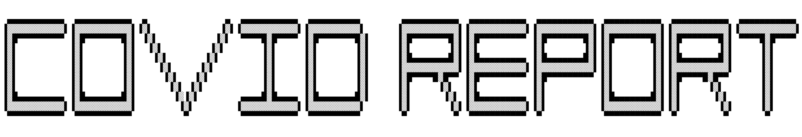

<h1 align="center">
                                                                                                                       
</h1>

  </img>

## Description
This application utilizes the terminal to report COVID cases within a given area. You can set it up with a cron that send hourly reminders.

This application was build with [Laravel Zero](https://laravel-zero.com).

## Example 

## Contribute

If you would like to add a feature or fix a bug, feel free to open a PR.
