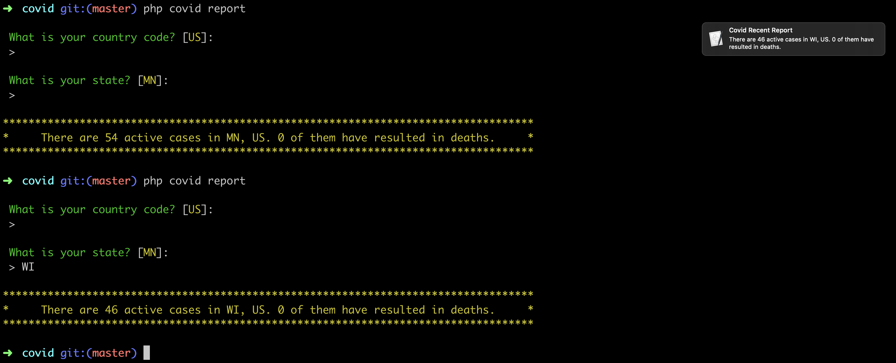

<h1 align="center">
   Covid Reporter                                                                                                                          
</h1>

  <a href="https://github.com/laravel-zero/framework/actions"></img></a>

##### This application utilizes the terminal to report COVID cases within a given area. You can set it up with a cron that send hourly reminders.

##### This application was build with [Laravel Zero](https://laravel-zero.com)

## Contribute

If you would like to add a feature or fix a bug, feel free to open a PR.
